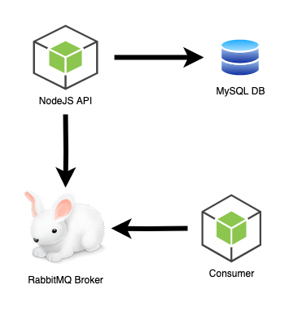

# Task Micro Services 
A simple micro services architecture that runs on NodeJS on ExpressJS framework using Sequelize for ORM to a MySQL database, and occasionally sends notifications to a queue on RabbitMQ. There is also a consumer service that listens to the notifications from the queue on RabbitMQ.

# Architecture Diagram
You can make updates to this diagram by importing [drawio xml file](./ArchitectureDiagramEdit.drawio) at [draw.io](https://draw.io)

# Documentation
Each service is seperated in their own folder. Each folder has a readme file for instructions on how to intialize and run locally.
- [MySQL Database](./database/)
- [NodeJS Backend API](./backend/)
- [RabbitMQ Notification Service](./notification-service/)
- [NodeJS Consumer Service](./consumer-service/)
